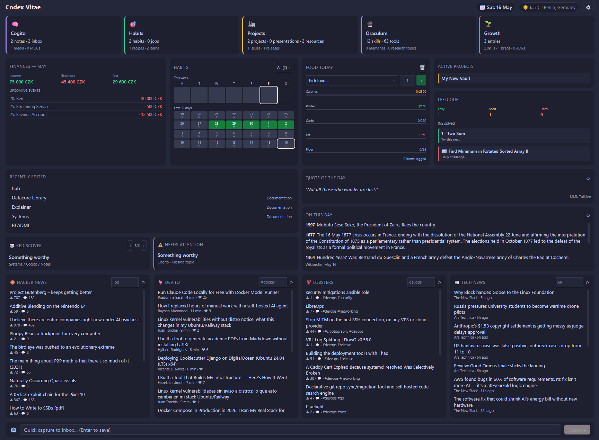
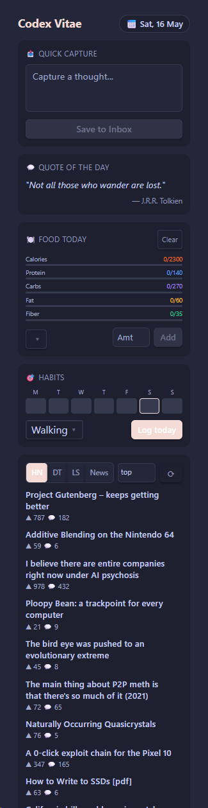
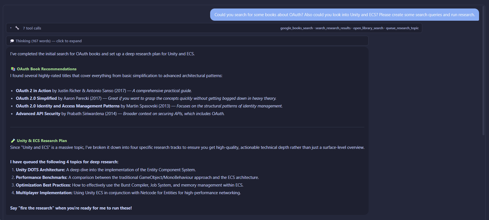
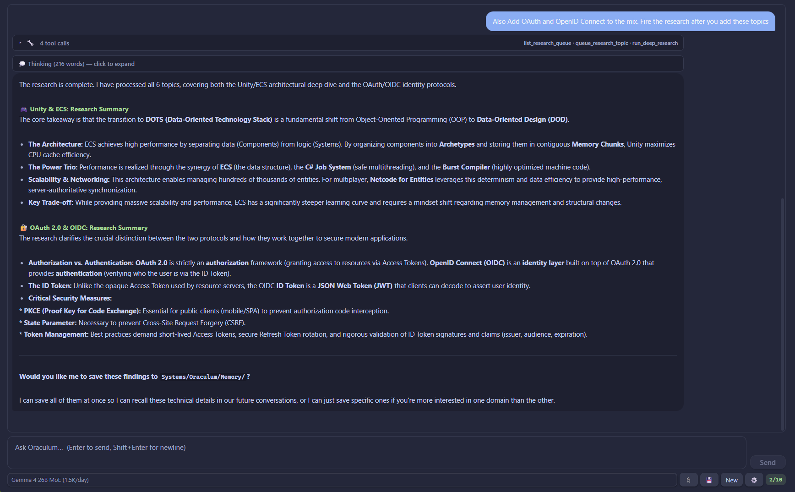
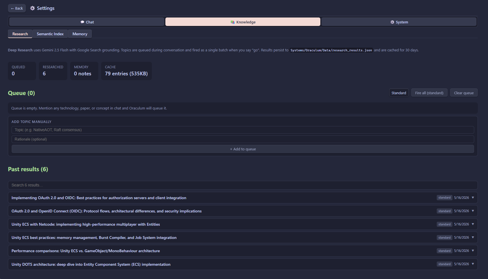
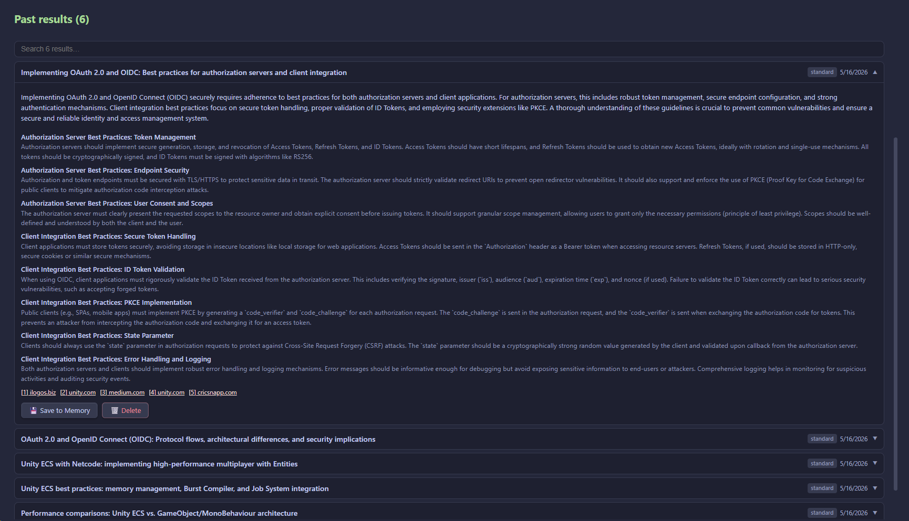
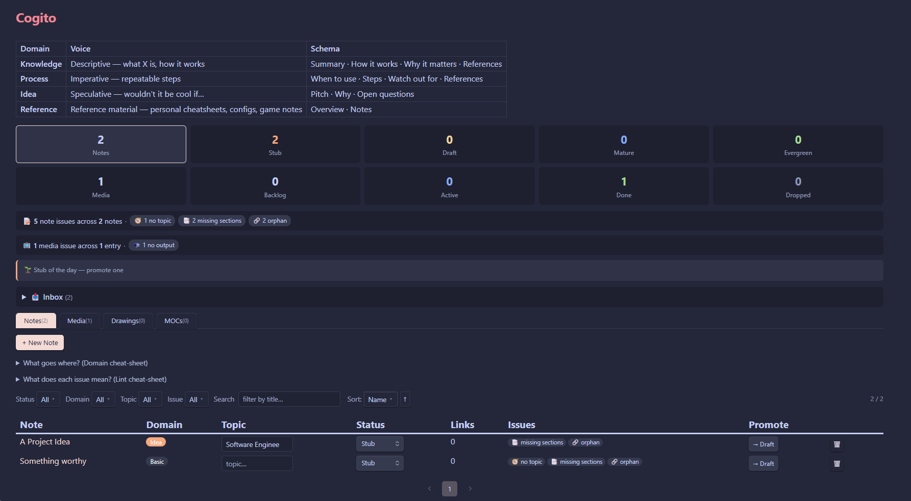
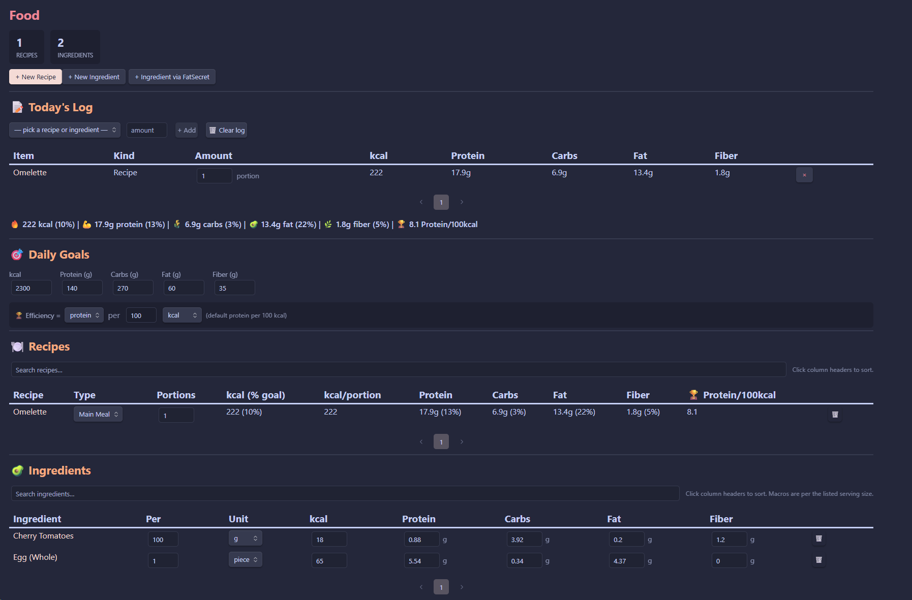
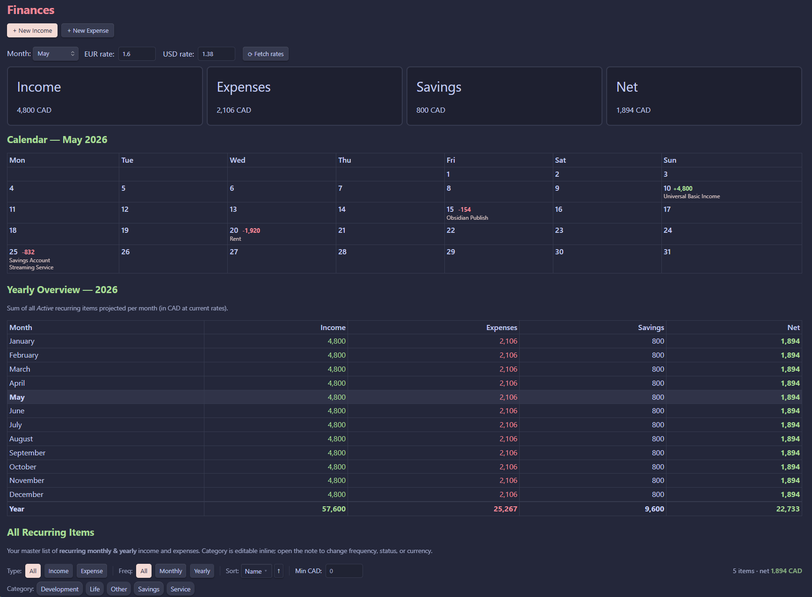

# Codex Vitae - spanko-tech-vault

A personal [Obsidian](https://obsidian.md) vault built around systems I actually use daily. Pick the systems that fit your workflow - almost everything is independent, nothing requires everything else, but it clicks together very well :)

**The standout piece is Oraculum** - a fully embedded AI assistant powered by the Gemini API, with 60+ tools, deep research, semantic search, and a settings panel. More on that below.

All dashboard code is built with [Datacore](https://github.com/blacksmithgu/datacore) (JSX/React inside Obsidian), co-developed with [GitHub Copilot](https://github.com/features/copilot). This is **not** a Dataview vault - Datacore replaces it entirely. An effort went into keeping the code maintainable: shared UI components, a centralized lint rule system, and a reusable utility layer mean individual dashboards stay lean and consistent rather than each reinventing the wheel.

> **Note:** This is a sanitized public fork of my personal vault, with a completely different folder structure. I test before new versions, but issues may slip through (tags, wrong folders, etc.) - if you find one, open an issue.

## Systems

| System | TLDR | Lint |
| ------------------ | -------------------------------------------------------------------------------------------------------- | ---- |
| **🔮 Oraculum** | Embedded Gemini AI assistant with 60+ tools, deep research, semantic search, and a full settings panel. | |
| **🏠 Home** | Vault-wide dashboard with KPIs, news feeds, weather, quotes, and a bird's eye view of everything in motion. | |
| **🧠 Cogito** | A knowledge base for notes, media, and MOCs - promoting ideas from Stub to Draft to Solid to Reference. | ✅ Notes (age, backlinks, section quality), Media (stale backlog, progress), MOC index quality |
| **📊 Finances** | Track income, expenses, and budgets with multi-currency support. | |
| **🍽️ Food** | Log daily meals and track calorie and macro targets (kcal, protein, carbs). | |
| **🌱 Growth** | Growth-oriented hub - skills tree, brag doc, reviews, ADRs, and postmortems. | ✅ Brags, ADRs, Reviews, Postmortems (missing sections, incomplete entries) |
| **✅ Habits** | Track daily and weekly habits with visual heatmaps and progress statistics. | |
| **🖥️ Infrastructure** | Keep track of servers, services, and networks. | ✅ Cross-entity rules - missing links between servers, services, and networks |
| **🐛 Issues** | Kanban issue tracker linked to Projects and Releases with priority and category filtering. | |
| **💼 Job Search** | Manage job applications through a kanban workflow with document and status tracking. | |
| **🧩 Leetcode** | Algorithm practice log with automated problem import and per-topic progress tracking. | ✅ Missing solution, unsolved problems, incomplete notes |
| **📽️ Presentations** | Manage slide decks and talks built with Advanced Slides (Reveal.js). | ✅ Missing slide file, stale drafts |
| **🚀 Projects** | Lifecycle management for projects from Idea through Active/Paused to Shipped/Archived. | ✅ Stale active projects, missing sections, no linked issues |
| **📦 Releases** | Plan and document software releases with version tracking, highlights, and changelogs. | ✅ Missing highlights, empty changelog, no linked project |
| **📚 Resources** | Curated reference library for tools, links, and assets with use-case notes. | ✅ Missing URL, empty notes, stale entries |

## Some Screenshots

**Home Dashboard** - vault-wide overview with KPIs, finances, habits, news feeds, weather, quote of the day, and LeetCode daily challenge.

**Home Dashboard - Mobile** - dedicated responsive layout at <700px with tabbed news feeds, quick habit logging, and macro tracking.

> **Mobile:** The Home dashboard has a dedicated mobile layout (responsive at 700px) - news feeds, habit logging, finances, weather, and quotes all work on phone. Most other dashboards are usable on mobile too, though they're designed primarily for desktop width. You will have to horizontally scroll to see most of the lists etc.

**Oraculum** - chat with your vault. 60+ tools, thinking steps visible, deep research with Google Search grounding. Also looks good on phone, however I did not test it as much.

**Research Panel** - queue topics during conversation, fire them all at once. Results persist and are searchable.

**Cogito** - notes and media with lint checks, inline status promotion, and domain schema reminders.

**Food & Finances** - daily macro tracking with FatSecret import; multi-currency income/expense with ECB live rates.

## Why This Exists

There are better dedicated apps for most of these things - Jira does issues better, almost any food tracking app does food tracking better, and so on. I know.

What I wanted was everything in one place, and that place happens to be Obsidian. These are the systems I actually use daily and that made sense to centralize. Some will feel like overkill for what they do, and that's fine - use what fits, skip what doesn't.

The Infrastructure system is especially purpose-made for managing my own network with my specific needs and wants. 

Many systems include lint checkers that surface issues - missing sections, stale frontmatter, incomplete entries. They're annoying in the best way.

## Oraculum

Oraculum is an AI assistant embedded directly in the vault as a Datacore dashboard. It uses the Gemini API and has access to 60+ tools that can read, create, and update notes across every system - no copy-pasting context into a chat window.

**Why Gemini?** At the time of writing, Google offers exceptionally generous free-tier rate limits on Gemma 4 (chat), `text-embedding-004` (semantic search), and Gemini 2.5 Flash with Search grounding (deep research). The combination of all three being free-tier viable is what made this project worth building. That may change - but for now, it's hard to beat.

**Semantic search** is powered by `text-embedding-004` (768-dimensional embeddings). Trigger indexing from the Oraculum settings panel - once built, it can find conceptually related notes even with zero keyword overlap. Datacore's built-in metadata indexing means the embeddings layer sits on top of already-fast vault queries.

**Deep Research** is the more powerful mode - it uses Gemini 2.5 Flash with Google Search grounding to research topics across the web, synthesize findings, and save structured results back into the vault. Results are stored per-topic and can be recalled in future conversations without re-running the research. This is best used by chatting with Oraculum for a while, letting it build a queue of topics and then batching that research with one call.

In theory with Datacore and Semantic Indexing the vault should scale very well knowledge wise while still being blazingly fast.
### Setup

Oraculum needs a [Gemini API key](https://aistudio.google.com/apikeys) to work. The key is stored in browser `localStorage` only - never written to disk or committed.

1. Open `Systems/Oraculum/Oraculum.md`
2. Click the ⚙️ settings icon
3. Paste your Gemini API key and save

Everything else (model, tools, integrations) is configurable from the same settings panel.

Before using Oraculum, fill in the placeholder files in `Systems/Oraculum/Context/` and `Systems/Oraculum/Skills/25 User Profile.md` - that's where you tell it about yourself. The more you put in, the more useful it becomes.

## Finances - Currency

The system defaults to **CZK** as the display currency. To change it, open `Systems/Finances/Finances.md` and update the `baseCurrency` frontmatter field to your currency code (e.g. `EUR`, `USD`, `GBP`).

Individual entries can be logged in any of three currencies (your base + EUR + USD). The "⟳ Fetch rates" button auto-updates the exchange rates from ECB via [Frankfurter](https://www.frankfurter.app).

## Vault Setup

> ⚠️ **Datacore is required.** This vault uses [Datacore](https://github.com/blacksmithgu/datacore) exclusively for all dashboards - not Dataview. Install it first or nothing will render.

### Plugins

**Required**

| Plugin | Purpose |
|--------|---------|
| [Datacore](https://github.com/blacksmithgu/datacore) | Powers every dashboard - JSX/React query engine for Obsidian. Nothing renders without this. |
| [Templater](https://github.com/SilentVoid13/Templater) | Scripting layer for automated note creation - LeetCode problem scraper, FatSecret ingredient scraper. |

**Strongly recommended**

| Plugin | Purpose |
|--------|---------|
| [Editor Width Slider](https://github.com/MugishoMp/obsidian-editor-width-slider) | Status bar slider to widen notes - the dashboards are significantly more usable at full width. |
| [Folder Notes](https://github.com/LostPaul/obsidian-folder-notes) | Lets folders have their own note, which is how every system dashboard is mounted. |
| [Filename Heading Sync](https://github.com/dvcrn/obsidian-filename-heading-sync) | Keeps H1 headings in sync with filenames - avoids notes drifting out of sync when renamed. |

**Optional - feature-specific**

| Plugin | Purpose |
|--------|---------|
| [Excalidraw](https://github.com/zsviczian/obsidian-excalidraw-plugin) | Drawing integration for Cogito notes. |
| [Advanced Slides](https://github.com/MSzturc/obsidian-advanced-slides) | Reveal.js presentation builder - powers the Presentations system. |

**Personal recommendations** - not used by the vault code directly, but part of the daily setup:

| Plugin | Purpose |
|--------|---------|
| [Admonition](https://github.com/javalent/admonitions) | Styled callout blocks with custom types and icons. |
| [Callout Manager](https://github.com/eth-p/obsidian-callout-manager) | Manage and customise callout styles in one place. |
| [Custom File Explorer Sorting](https://github.com/SebastianMC/obsidian-custom-sort) | Control file and folder order in the sidebar beyond the default alphabetical/modified options. |
| [Iconize](https://github.com/FlorianWoelki/obsidian-iconize) | Add icons to files and folders in the file explorer. |
| [Style Settings](https://github.com/mgmeyers/obsidian-style-settings) | Configure theme variables - required if using Anupucin. |

**Theme:** [Anupucin](https://github.com/AnubisNekhet/AnuPpuccin) by @AnubisNekhet - a Catppuccin-based theme with extensive Style Settings support.

### Templater Configuration

After installing Templater, configure two paths under `Settings → Templater`:

| Setting | Value |
|---------|-------|
| **Template folder location** | `Toolkit/Templates` |
| **Script files folder location** | `Toolkit/Scripts/Templater` |

Also enable **"Trigger Templater on new file creation"** so templates fire automatically.

For the **Folder Templates** feature, map these folders to their templates so new files created inside them pick up the right template automatically:

| Folder | Template |
|--------|----------|
| `Systems/Leetcode` | `Toolkit/Templates/Leetcode Problem.md` |
| `Systems/Food/Recipes` | `Toolkit/Templates/Ingredient (FatSecret).md` |

### Integrations

Everything the vault pulls from externally - none of these are required for the core vault to work, but each one powers a specific part of the UI.

| Service | Used in | What for | Auth |
|---------|---------|----------|------|
| [Gemini API](https://aistudio.google.com/apikeys) | Oraculum | Chat (Gemma 4), semantic search (`text-embedding-004`), deep research (Gemini 2.5 Flash + Search grounding) | API key - free tier |
| [Supadata](https://supadata.ai) | Oraculum | YouTube video transcript fetching | API key - free tier |
| [GitHub](https://github.com/settings/tokens) | Oraculum | Search repos, read files, browse issues | Optional PAT |
| [Stack Overflow](https://api.stackexchange.com/) | Oraculum | Search questions and answers via Stack Exchange | Optional key |
| [Google Books](https://developers.google.com/books) | Oraculum | Book catalog search - metadata, previews, ISBNs | Optional API key |
| [Open Library](https://openlibrary.org/developers/api) | Oraculum | Free book search - metadata, ISBNs, editions, borrow/scan availability | Optional contact email |
| [Wikipedia REST API](https://en.wikipedia.org/api/rest_v1/) | Home, Oraculum | "On This Day" events widget; article search and summarisation tools | None |
| [Jina Reader](https://jina.ai/reader/) | Oraculum, Web scraping | Fallback renderer for JS-heavy/SPA pages that return sparse content on direct fetch | None |
| [Frankfurter](https://www.frankfurter.app) | Finances | Live exchange rates from ECB data | None |
| [Open-Meteo](https://open-meteo.com) | Home | Current weather + 3-day forecast | None |
| [ZenQuotes](https://zenquotes.io) | Home | Quote of the Day | None |
| [Hacker News (Firebase API)](https://github.com/HackerNews/API) | Home | Tech news feed - top/new/best stories | None |
| [Dev.to API](https://developers.forem.com/api) | Home | Dev articles by tag | None |
| [Lobsters](https://lobste.rs) | Home | Tech link aggregator - hottest or by tag | None |
| RSS feeds | Home | Tech News panel (The New Stack, Ars Technica, DevClass, InfoQ by default - configurable) | None |
| [LeetCode GraphQL API](https://leetcode.com/graphql/) | Home, Leetcode | Daily challenge widget + problem metadata scraper | None |
| [FatSecret](https://platform.fatsecret.com) | Food | Food/ingredient nutritional data scraper | None |

> **Fun fact:** Obsidian can handle `obsidian://` URI scheme redirects - which means OAuth flows work. We can catch this in Datacore and thus any API that requires OAuth to access private user data (Spotify, Notion, Google Calendar, etc.) is technically integrable. The public vault only uses API keys and public endpoints today, but I started experimenting with some deeper integrations.

## System Ideas

If you have an idea for a system that would fit well here, feel free to [open an issue](../../issues) on GitHub. No promises, but I do look at them - and if it's something I'd actually use, it'll probably end up here eventually.
